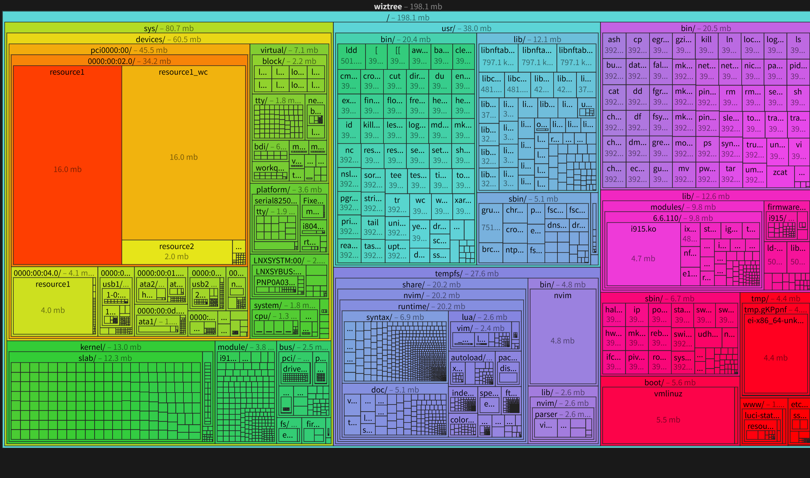
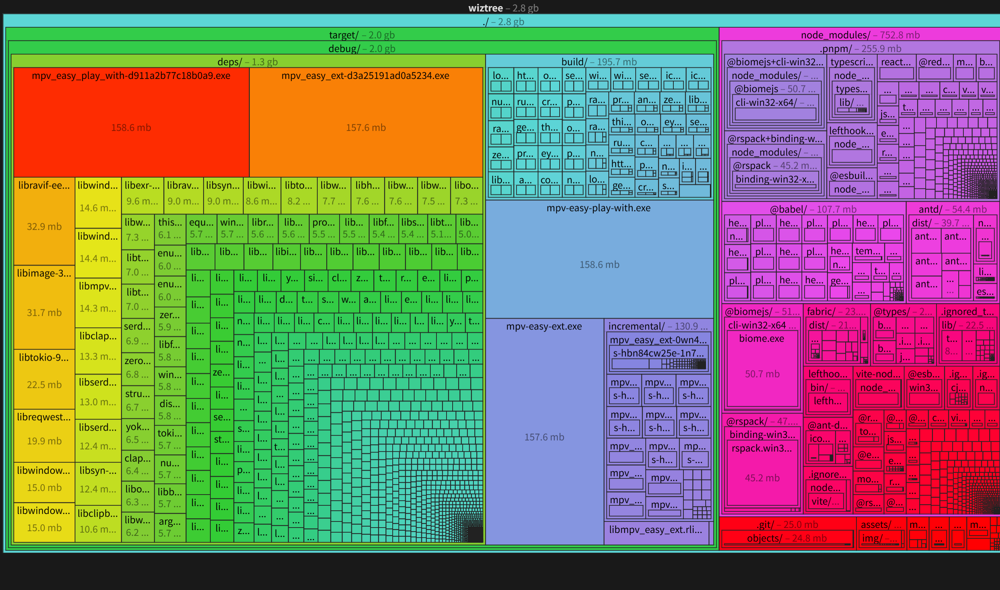

# wiztree-metafile

A high-performance Rust library and CLI tool for analyzing directory structures and file information. Designed to handle extremely large file systems (100,000+ files) efficiently with configurable traversal strategies, multi-threading support, and memory-efficient streaming.

## Related Tools

This tool is inspired by and compatible with:

- **[WizTree](https://www.diskanalyzer.com/)** - The Fastest Disk Space Analyzer for Windows
- **[bloaty-metafile](https://github.com/ahaoboy/bloaty-metafile)** - Convert bloaty output to esbuild metafile format
- **[esbuild Bundle Size Analyzer](https://esbuild.github.io/analyze/)** - Visualize and analyze bundle sizes

The output format is compatible with esbuild's metafile format, allowing you to visualize directory structures using esbuild's analyzer.

## Features

- **Configurable Depth Limits**: Control how deep to traverse directory structures
- **File Count Limits**: Prevent excessive processing time on large file systems
- **Multiple Traversal Strategies**: Choose between depth-first and breadth-first traversal
- **Size Filtering**: Focus on files above a minimum size threshold (in bytes)
- **Multi-threading**: Leverage multiple CPU cores for faster processing
- **Symbolic Link Handling**: Correctly handle symlinks, prevent circular references, and avoid duplicate counting
- **Flexible Output**: Output to stdout (human-readable text) or file (JSON format)
- **Progress Indicators**: Optional progress reporting for large directories (with `progress` feature)

## Installation

### From Source

```bash
git clone <repository-url>
cd wiztree-metafile
cargo build --release
```

The binary will be available at `target/release/wiztree-metafile`.

### As a Library

Add to your `Cargo.toml`:

```toml
[dependencies]
file_analyzer = { path = "path/to/wiztree-metafile" }
```

## CLI Usage

### Basic Usage

Analyze the current directory:

```bash
wiztree-metafile .
```

### Command-Line Options

```
Usage: wiztree-metafile [OPTIONS] <PATH>

Arguments:
  <PATH>  Root directory to analyze

Options:
  -d, --max-depth <MAX_DEPTH>    Maximum depth to traverse (1 to system max)
  -n, --max-files <MAX_FILES>    Maximum number of files to process
  -s, --strategy <STRATEGY>      Traversal strategy: depth-first, breadth-first, dfs, bfs [default: depth-first]
  -m, --min-size <MIN_SIZE>      Minimum file size in bytes [default: 0]
  -t, --threads <THREADS>        Number of threads (1 to CPU count)
  -o, --output <OUTPUT>          Output file path
  -f, --format <FORMAT>          Output format: text, json, metafile [default: metafile]
  -i, --ignore <IGNORE>          Ignore patterns (glob format, can be specified multiple times)
  -h, --help                     Print help
  -V, --version                  Print version
```

### Examples

**Analyze with depth limit:**
```bash
wiztree-metafile . -d 3
```

**Analyze only files >= 1KB:**
```bash
wiztree-metafile . -m 1024
```

**Use breadth-first traversal:**
```bash
wiztree-metafile . -s breadth-first
```

**Limit to 1000 files:**
```bash
wiztree-metafile . -n 1000
```

**Use 4 threads:**
```bash
wiztree-metafile . -t 4
```

**Output to JSON file:**
```bash
wiztree-metafile . -o results.json
```

**Ignore specific paths:**
```bash
# Ignore node_modules directories
wiztree-metafile . -i "**/node_modules/**"

# Ignore multiple patterns
wiztree-metafile . -i "**/node_modules/**" -i "**/.git/**" -i "**/target/**"

# Ignore system directories (Linux)
wiztree-metafile / -i "/proc/**" -i "/sys/**" -i "/dev/**"

# Ignore common build and version control directories
wiztree-metafile . \
  -i "**/.git/**" \
  -i "**/target/**" \
  -i "**/node_modules/**" \
  -i "**/.idea/**" \
  -i "**/.vscode/**" \
  -o analysis.json
```

**Combine multiple options:**
```bash
wiztree-metafile ./node_modules -d 5 -m 1024 -n 10000 -t 8 -o analysis.json
```

## Library Usage

### Basic Example

```rust
use file_analyzer::{AnalyzerConfig, FileAnalyzer, TraversalStrategy};
use std::path::PathBuf;

fn main() {
    let mut config = AnalyzerConfig::new(PathBuf::from("."));
    config.max_depth = Some(3);
    config.min_file_size = 1024; // Only files >= 1KB
    config.traversal_strategy = TraversalStrategy::DepthFirst;

    let analyzer = FileAnalyzer::new(config);
    match analyzer.analyze() {
        Ok(result) => {
            println!("Total size: {} bytes", result.total_size);
            println!("File count: {}", result.file_count);
            println!("Directory count: {}", result.directory_count);

            for entry in result.entries {
                println!("{}: {} bytes", entry.path.display(), entry.size);
            }
        }
        Err(e) => eprintln!("Error: {}", e),
    }
}
```

### Advanced Configuration

```rust
use file_analyzer::{AnalyzerConfig, FileAnalyzer, TraversalStrategy};
use std::path::PathBuf;

let mut config = AnalyzerConfig::new(PathBuf::from("./node_modules"));
config.max_depth = Some(5);
config.max_files = Some(10000);
config.traversal_strategy = TraversalStrategy::BreadthFirst;
config.min_file_size = 1024;
config.thread_count = 8;
config.output_path = Some(PathBuf::from("output.json"));

let analyzer = FileAnalyzer::new(config);
let result = analyzer.analyze()?;
```

## Performance Characteristics

### Memory Usage

- **Streaming Processing**: Files are processed as they're discovered, not loaded all at once
- **Efficient Data Structures**: Uses `HashSet` for O(1) inode lookups
- **Atomic Counters**: Lock-free counter updates for better performance

### Threading

- **Single-threaded Mode**: Minimal overhead for small directories
- **Multi-threaded Mode**: Distributes work across CPU cores
- **Thread Pool**: Uses `rayon` for efficient thread management

### Optimizations

- **Early Termination**: Stops immediately when file count limit is reached
- **Lazy Evaluation**: Only resolves symlinks when necessary
- **Depth Checking**: Skips directories beyond depth limit before reading

## Visualizing Results

The metafile output can be visualized using esbuild's analyzer:

1. Generate a metafile:
```bash
wiztree-metafile . -o metafile.json
```

2. Upload `metafile.json` to [esbuild's Bundle Size Analyzer](https://esbuild.github.io/analyze/)

3. Explore your directory structure interactively with a sunburst chart

## Use Cases

### Analyzing node_modules

```bash
wiztree-metafile ./node_modules -d 10 -m 1024 -o node_modules_analysis.json
```

### Analyzing System Directories

```bash
wiztree-metafile /usr -d 5 -n 50000 -t 8
```

### Finding Large Files

```bash
wiztree-metafile . -m 10485760  # Files >= 10MB
```

### Real-World Examples

#### OpenWrt System File Analysis

Analyze OpenWrt system files to understand disk usage:

```bash
# Analyze OpenWrt system files, ignoring virtual filesystems
wiztree-metafile / -i "/proc" -o openwrt-analysis.json
```

This helps identify:
- Which packages consume the most space
- Large firmware files and kernel modules
- Potential cleanup targets for embedded systems



#### MPV-Easy Project Build Analysis

Analyze compiled binaries and build artifacts:

```bash
# Analyze mpv-easy build output
wiztree-metafile ./mpv-easy -o mpv-easy.json

```

This helps:
- Identify the largest compiled components
- Optimize build output size
- Find unnecessary dependencies
- Analyze distribution package size




## Ignoring Paths

The tool supports glob patterns for ignoring specific paths:

### Glob Pattern Syntax

- `*` - Matches any characters except `/`
- `**` - Matches any characters including `/` (recursive)
- `?` - Matches a single character
- `[abc]` - Matches any character in the set
- `{a,b}` - Matches either pattern

### Common Patterns

**Ignore specific directory names anywhere:**
```bash
wiztree-metafile . -i "**/.git/**" -i "**/target/**"
```

**Ignore directories in current path only:**
```bash
wiztree-metafile . -i ".git" -i "target"
```

**Ignore by file extension:**
```bash
wiztree-metafile . -i "**/*.tmp" -i "**/*.log"
```

**Ignore multiple patterns for Rust projects:**
```bash
wiztree-metafile . \
  -i "**/.git/**" \
  -i "**/target/**" \
  -i "**/*.rlib" \
  -i "**/Cargo.lock" \
  -o rust-project.json
```

**Ignore multiple patterns for Node.js projects:**
```bash
wiztree-metafile . \
  -i "**/.git/**" \
  -i "**/node_modules/**" \
  -i "**/dist/**" \
  -i "**/.next/**" \
  -o nodejs-project.json
```

## Symbolic Link Handling

The tool correctly handles symbolic links:

- **Duplicate Detection**: Files referenced by multiple symlinks are counted only once
- **Circular Reference Prevention**: Detects and skips circular directory links
- **Target Resolution**: Resolves symlink targets and includes them in output

## Output Format

### Text Output (stdout)

```
=== File Analysis Results ===

Total Size: 1234567 bytes (1.18 MB)
File Count: 42
Directory Count: 10
Symlink Count: 3

=== Warnings (1) ===
  - Circular symlink detected: /path/to/circular

=== Files (42) ===
  [Depth 1] 1024 bytes: ./file1.txt
  [Depth 2] 2048 bytes: ./dir/file2.txt -> /target/file
  ...
```

### JSON Output (file)

```json
{
  "total_size": 1234567,
  "file_count": 42,
  "directory_count": 10,
  "symlink_count": 3,
  "entries": [
    {
      "path": "./file1.txt",
      "size": 1024,
      "depth": 1,
      "is_symlink": false,
      "target": null
    }
  ],
  "warnings": [
    "Circular symlink detected: /path/to/circular"
  ],
  "incomplete": false
}
```

## Features

### Optional Features

Enable progress indicators:

```bash
cargo build --features progress
```

## Troubleshooting

### Permission Denied Errors

The tool continues processing when it encounters permission denied errors and logs them as warnings.

### Circular Symlinks

Circular symlinks are automatically detected and skipped with a warning message.

### Memory Issues

If analyzing very large directories:
- Use `--max-files` to limit the number of files processed
- Use `--max-depth` to limit traversal depth
- Increase `--min-size` to filter out small files

### Thread Count

The tool automatically clamps thread count to the valid range (1 to CPU count). If you specify an invalid value, it will be adjusted automatically.

## Platform Support

- **Unix/Linux**: Full support including inode-based duplicate detection
- **Windows**: Full support (duplicate detection limited due to API constraints)
- **macOS**: Full support including inode-based duplicate detection

## License

[Add your license here]

## Contributing

[Add contribution guidelines here]
